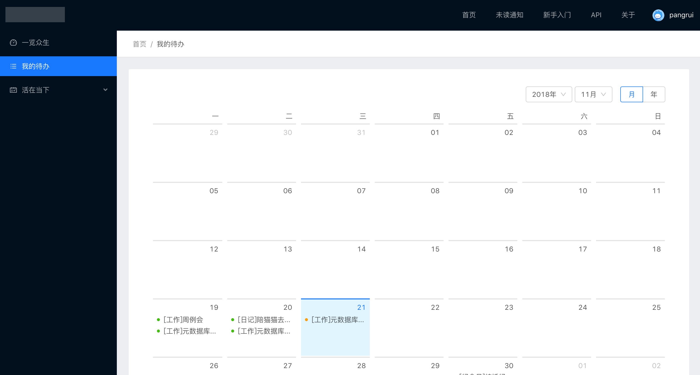
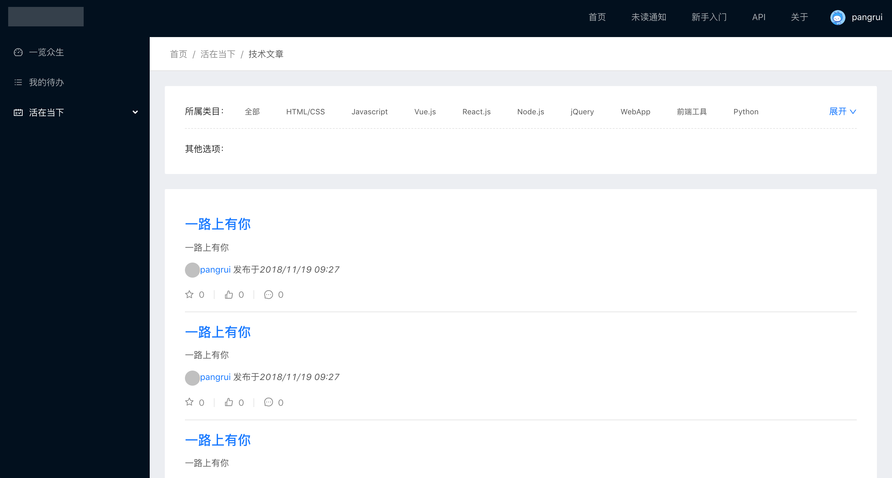

# 全栈项目

## 站点截图

## 技术支持

- react
- dva
- umi
- mysql
- sequelize
- nodejs 
- koa2

## 下载

* 直接下载 https://github.com/ruizhengyun/react-dva-umi-sql-sequelize-node-koa2
* git下载 `git clone git@github.com:ruizhengyun/react-dva-umi-sql-sequelize-node-koa2.git`

## 交流

* QQ群   679119211
* 我博客  http://www.ruizhengyun.cn/
* 订阅号  前端明信片
 

## 关于提问-问题被分享，统一收集

程序员的主流提问方式：
* 直接在[github issues] (https://github.com/ruizhengyun/react-dva-umi-sql-sequelize-node-koa2/issues) 提交问题，问题可供享
* 去 [知乎](https://www.zhihu.com/)提问，并邀请[作者](https://www.zhihu.com/people/ruizhengyun)来回答
* 去[segmentfault](https://segmentfault.com/)提问，并邀请[作者](https://segmentfault.com/u/jianghuzaijian)来回答